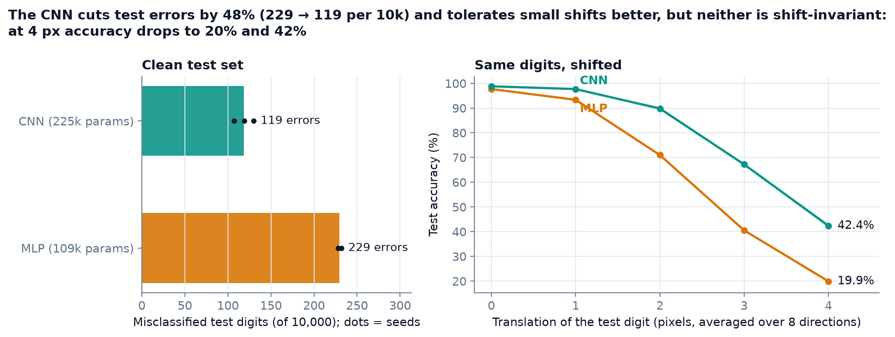
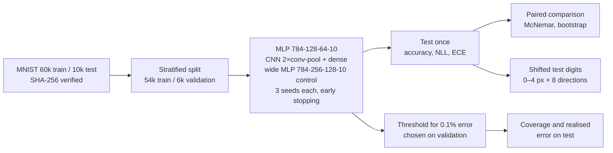
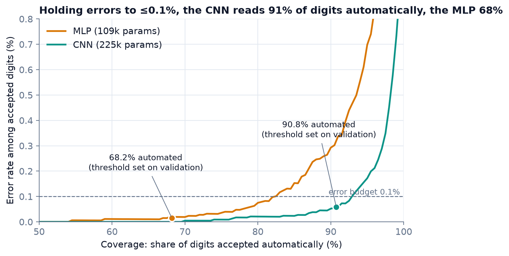
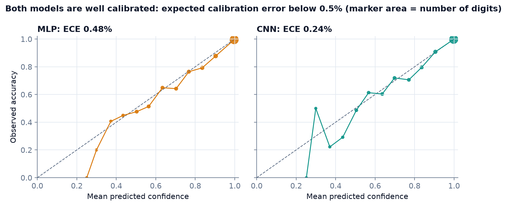
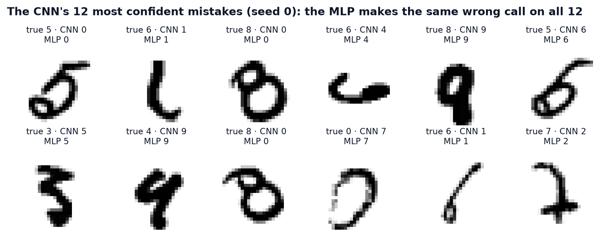
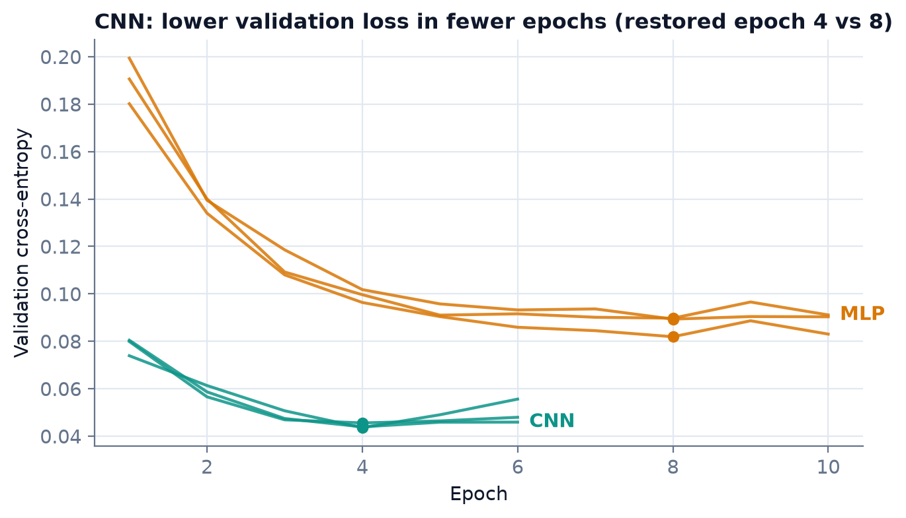

# mnist-case-study

What does convolution actually buy over a dense network on handwritten digits? Measured with paired
significance tests, a parameter-matched dense control, calibration, robustness to shifted inputs, and an
error-budget rule that turns accuracy into manual workload.

[](https://github.com/Pchambet/mnist-case-study/actions/workflows/ci.yml)

[](LICENSE)
[](https://pchambet.github.io/mnist-case-study/)



## TL;DR

- **The CNN makes 48% fewer mistakes.** Mean of 3 seeds on the 10,000-digit test set: MLP 97.71% ± 0.02%
  (229 errors), CNN 98.81% ± 0.11% (119 errors). Paired bootstrap gain +1.11 points, 95% CI [0.90, 1.32];
  exact McNemar p < 1e-12 on every seed.
- **Capacity is not the explanation.** A wider MLP with more parameters than the CNN (235k against 225k),
  trained the same way, makes 230 errors, no fewer than the 109k MLP. The CNN beats it by +1.12 points,
  95% CI [0.92, 1.32].
- **Accuracy understates the operational gap.** Under a budget of at most 1 error per 1,000 automatically
  read digits, with the confidence threshold fixed on validation data, the MLP can automate 68.2% of the
  test stream and the CNN 90.8%: the manual queue shrinks from 31.8% to 9.3%.
- **Convolution gives tolerance to small shifts, not invariance.** Moving each digit by 2 px drops the MLP
  to 71.0% and the CNN to 89.8%; at 4 px both collapse (19.9% and 42.4%).
- **Both models are well calibrated** (expected calibration error 0.48% and 0.24%), so the softmax score
  can be read as a probability. The threshold rule itself only needs the ranking of confidences and is set
  on validation.
- **The hardest digits are shared.** The CNN's 12 most confident mistakes are all misread the same way by
  the MLP; 4→9 is the top confusion for both.

## Why it matters

Reading digits is a routine operational task (forms, postal codes, part numbers on maintenance cards),
and nobody deploys a reader that must be right every time. The real decision is how much of the stream can
be handled without a person at an acceptable error rate, and how fragile that is when inputs are not as
clean as the benchmark. This case study answers that question for the two textbook architectures, with
the uncertainty of every number made explicit.

## Approach



1. **Data.** The canonical `mnist.npz`, downloaded once and checked against a pinned SHA-256. A seeded,
   stratified 10% of the training set is held out for early stopping and threshold selection; the test set
   is touched only for final scoring.
2. **Models.** A 109k-parameter MLP (with dropout) and a 225k-parameter LeNet-style CNN, plus a capacity
   control: a 235k-parameter MLP (784-256-128-10, same recipe). All use Adam (lr 1e-3),
   batch 128, early stopping on validation loss (patience 2, best weights restored). Seeds 0, 1, 2 with
   deterministic TensorFlow ops, so every run is reproducible on the same platform and TensorFlow version.
3. **Evaluation.** Accuracy, negative log-likelihood and expected calibration error; exact McNemar test per
   seed and a paired bootstrap over test images; accuracy on translated digits; selective risk (error among
   accepted digits) against coverage.
4. **Decision rule.** For an error budget of 0.1%, pick on validation the lowest confidence threshold whose
   accepted set stays within budget, freeze it, and report the coverage and error it yields on test.

## Results

| | MLP | CNN | Wide MLP (control) |
|---|---:|---:|---:|
| Parameters | 109,386 | 225,034 | 235,146 |
| Test accuracy (mean ± sd, 3 seeds) | 97.71% ± 0.02% | 98.81% ± 0.11% | 97.70% ± 0.28% |
| Test errors per 10,000 | 229 | 119 | 230 |
| Negative log-likelihood | 0.0759 | 0.0355 | 0.0761 |
| Expected calibration error | 0.48% | 0.24% | 0.54% |
| Accuracy with 2 px / 4 px shift | 71.0% / 19.9% | 89.8% / 42.4% | 70.9% / 20.5% |
| Automated at ≤ 0.1% error (realised error) | 68.2% (0.015%) | 90.8% (0.059%) | 75.0% (0.039%) |
| Restored epoch (of epochs run) | 8 of 10 | 4 of 6 | 7 of 9, 4 of 6, 4 of 6 |
| CPU training time per run (3 threads, shared machine) | 28–38 s | 197–242 s | 31–45 s |

Per-seed numbers are in [`results/runs.csv`](results/runs.csv); every figure in this README is computed
from [`results/`](results).

**The gap is not test-set luck.** On seed 0, 165 test digits are right only for the CNN against 44 right
only for the MLP (63 missed by both). Seeds move the MLP's or the CNN's error count by at most 23 digits;
changing the architecture moves it by 111.

**Capacity or convolution?** The CNN has about twice the MLP's parameters, so a larger dense network might
close the gap. It does not: doubling both hidden layers (235k parameters, more than the CNN) leaves the
error count at 230, with a wider seed spread (213 to 263) because one seed stopped early. Against that
control the CNN's gain is +1.12 points, 95% CI [0.92, 1.32], McNemar p < 1e-11 on every seed, and the
wide MLP is no more tolerant of shifts (70.9% at 2 px). Under the error budget it automates 75.0% of the
stream, between the two main models.



**Automating under an error budget.** The validation-chosen thresholds stay within budget on test for every
seed, and they are conservative: with hindsight (tuning on the test set, which a deployment cannot do) the
same budget would allow 82.4% for the MLP and 93.4% for the CNN. With 6,000 validation digits there are
very few errors to set a 0.1% threshold on, and the MLP pays more for that caution.



**Calibration.** Confidence tracks accuracy closely for both models (diagrams pool the 3 seeds; the ECE
quoted is the mean over seeds). Over 93% of digits sit in the top bin (confidence above 0.93), which dominates the ECE; the
sparse low-confidence bins hold only a handful of digits each.



**Error analysis.** On seed 0, 63 of the CNN's 107 errors are also MLP errors, and its 12 most confident
mistakes are all misread the same way by the MLP; several are hard to read for a person too. The other 44
CNN errors are digits the MLP gets right, so the CNN is better overall but not uniformly.



The interactive version of all charts, with the per-seed tables, is in the
[report](https://pchambet.github.io/mnist-case-study/) (`site/index.html`).

## Walkthrough notebooks

Two pedagogical notebooks build the models step by step, from raw pixels to error analysis:

- [`notebooks/01_mlp_walkthrough.ipynb`](notebooks/01_mlp_walkthrough.ipynb): data exploration,
  preprocessing, a dense network trained with plain SGD, confusion matrix.
- [`notebooks/02_cnn_walkthrough.ipynb`](notebooks/02_cnn_walkthrough.ipynb): why flattening loses
  information, channel dimension, convolution and pooling, training and error analysis.

They are single runs with their own settings (SGD and a last-10% validation split in notebook 01), so the
numbers they print are not the study's numbers. Forward and backward propagation for networks of any depth,
written by hand in NumPy and gradient-checked, is in
[Deep-Learning-from-Scratch](https://github.com/Pchambet/Deep-Learning-from-Scratch).

## Reproduce

Requires [uv](https://docs.astral.sh/uv/). CPU only; no GPU needed.

```bash
make setup     # uv sync --locked (Python 3.12, TensorFlow 2.21)
make data      # downloads and verifies MNIST (11 MB) into data/raw/
make run       # trains 3 models × 3 seeds, analyses, renders docs/figures/
make report    # writes site/index.html
```

`make run` took about 21 minutes wall-clock on a 10-core Apple Silicon laptop limited to 3 TensorFlow
threads and shared with other jobs (18 minutes for the MLP and CNN, 3 for the wide-MLP control; peak memory
about 0.8 GB, about 26 MB of cached models and predictions in `data/interim/`). Runs are cached per
model, seed and training config, so an interrupted run resumes and a changed config (e.g. `--max-epochs`)
retrains the affected runs and their predictions. `make test` runs the offline test suite on a committed
800-digit fixture, `make lint` runs ruff, and `make notebooks` re-executes both walkthroughs.

## Repository layout

```
src/mnist_study/
  data.py       download, checksum, stratified split, test fixture
  models.py     MLP, CNN and wide-MLP control, deterministic seeding
  train.py      cached training and prediction for each (model, seed)
  shift.py      zero-filled image translations
  metrics.py    calibration, McNemar, paired bootstrap, risk-coverage, error-budget threshold
  analyze.py    predictions -> results/*.csv, results/summary.json
  figures.py    results -> docs/figures/*.png
  report.py     results -> site/index.html
  cli.py        `uv run mnist-study {data,train,analyze,figures,report,fixture}`
tests/          unit tests with hand-checked cases and known-ground-truth simulations
notebooks/      two walkthrough notebooks
results/        small result tables (committed)
docs/figures/   README figures
site/           static report, deployed with GitHub Pages
```

## Methodology notes and limitations

- **Three seeds** show that seed variance is small next to the architecture gap; they are too few to
  estimate that variance precisely. The bootstrap interval covers test-set sampling, not training noise.
- **No tuning, no augmentation.** Both models are textbook defaults. A tuned or augmented MLP would narrow
  the clean-accuracy gap, and modern CNNs exceed 99.5%; this study compares two small models of the same
  order of size (the CNN has about twice the parameters), not the best of each family.
- **Architecture and capacity are separated by one control only.** The wide MLP matches the CNN's parameter
  count, not every other difference: both MLPs use dropout and the CNN does not, and no regularisation was
  tuned for either. Three seeds of one wider shape rule out "more parameters" as the explanation, not
  every possible dense design.
- **The shift test is synthetic.** Rigid, zero-filled translations isolate one property (sensitivity to
  position) rather than reproduce a real capture process. Diagonal directions move d px along each axis
  (5.7 px in straight-line distance at 4 px). At 4 px about a quarter of shifted digits lose some stroke at
  the border (98.7% of ink kept on average, against 99.9% at 2 px), so part of the 4 px drop is lost
  information, not fragility. Training with random shifts is the standard remedy and is not tested here.
- **The 0.1% threshold is noisy.** It is set on 6,000 validation digits, so about six tolerated errors;
  the realised test error is always reported next to the coverage.
- **Timing is indicative only.** Training times come from a shared laptop under load and vary between runs;
  parameter counts are the stable cost measure.
- **MNIST is easy and clean.** Conclusions about calibration and selective prediction should be re-checked
  on harder, noisier data before being trusted elsewhere.

## References

- Y. LeCun, L. Bottou, Y. Bengio, P. Haffner. *Gradient-based learning applied to document recognition.*
  Proceedings of the IEEE, 1998.
- Data: [MNIST](https://yann.lecun.com/exdb/mnist/) by Y. LeCun, C. Cortes and C. J. C. Burges, commonly
  distributed under CC BY-SA 3.0; file mirrored by
  [Keras](https://storage.googleapis.com/tensorflow/tf-keras-datasets/mnist.npz).
- Q. McNemar. *Note on the sampling error of the difference between correlated proportions or
  percentages.* Psychometrika, 1947.
- T. G. Dietterich. *Approximate statistical tests for comparing supervised classification learning
  algorithms.* Neural Computation, 1998.
- C. Guo, G. Pleiss, Y. Sun, K. Q. Weinberger. *On calibration of modern neural networks.* ICML, 2017.
- Y. Geifman, R. El-Yaniv. *Selective classification for deep neural networks.* NeurIPS, 2017.

---

Built by [Pierre Chambet](https://github.com/Pchambet) — decision science for operations under uncertainty.
